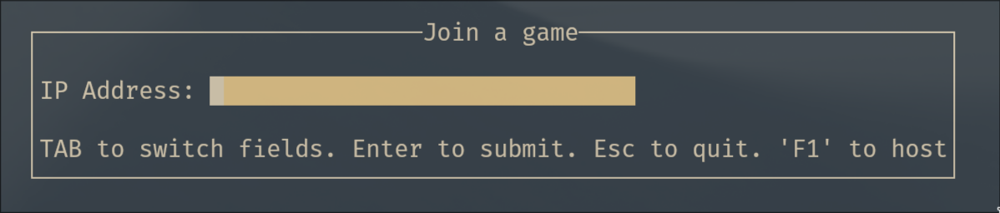
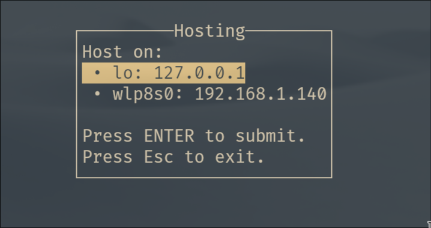
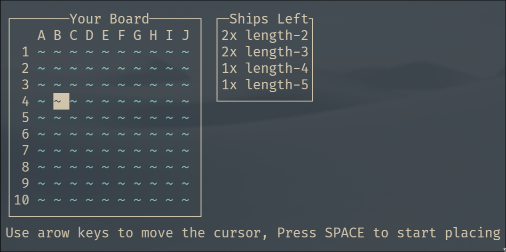
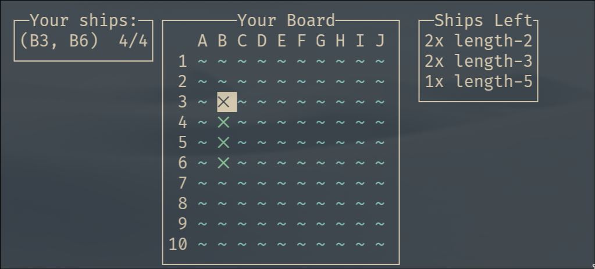
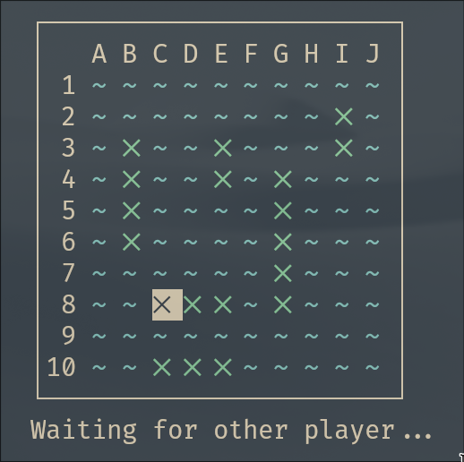
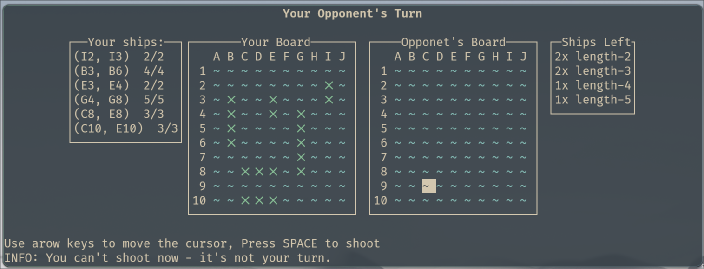
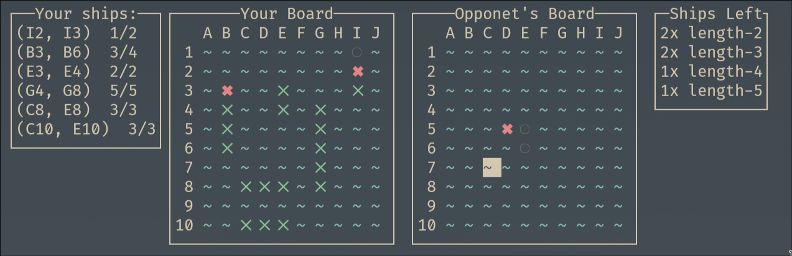
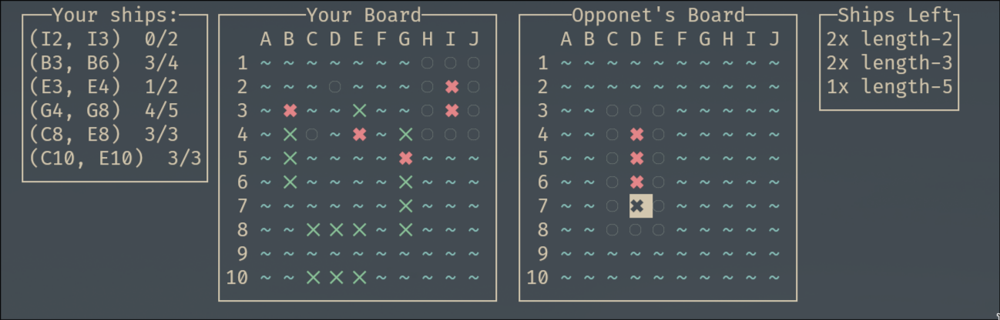
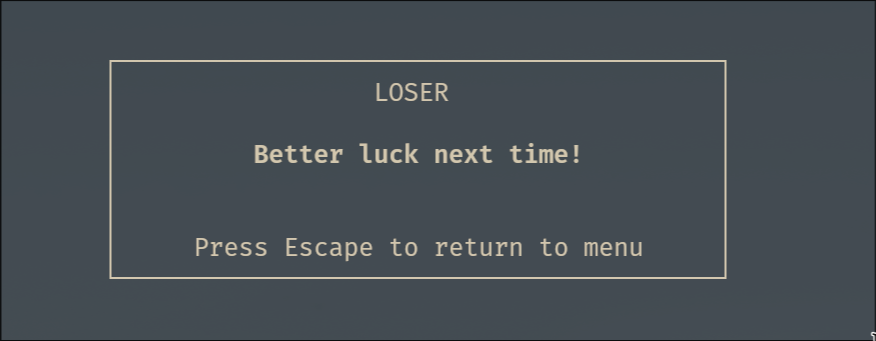

# Projekt PF - Dokumentacja
*Bartosz Nowak 325201, Łukasz Suchołbiak 325236*

## Temat projektu
Tematem projektu była realizacja gry [Battleship](https://en.wikipedia.org/wiki/Battleship) przez TCP/IP z terminalowym UI.

W celu realizacji projektu wykorzystaliśmy następujące narzędzia:
* `Haskell` (`ghc 9.12.1`)
* `Cabal` - w celu realizacji budowania oraz zarządzania zależnościami
* `Brick` - w celu realizacji TUI w alternatywnym buforze terminala.
* `network-info` - w celu pobrania informacji o dostępnych interfejsach na maszynie

## Instrukcja użycia

### Rozpoczęcie rozgrywki

Gra rozpoczyna się do prostego menu, w którym użytkownik podaje adres IP przeciwnika hostującego rozgrywkę.



Możliwe jest również hostowanie rozgrywki za pomocą przycisku `F1`



W tym miejscu użytkownik wybiera interfejs sieciowy, który zostanie użyty do hostowania, wybór interfejsu odbywa się za pomocą strzałek oraz przycisku `ENTER`


### Faza przygotowania

W tej fazie gracze ustawiają na swojej planszy statki. Za pomocą kursora należy wybrać pole na planszy, które będzie rozpoczynać statek. Następnie należy nacisnąc `ENTER` w celu rozpoczęcia ustawiania.
Kolejnym krokiem jest przesunięcie kursora na pole końcowe statku. Jeśli zaznaczony statek jest właściwy oraz może być postawiony (patrz tabelka `Ships Left` poniżej) zostanie on umieszczony na mapie w formie niebieskich znaków `X`





Obowiązują następujące reguły ustawiania statków:
* Każdy statek musi być ustawiony w linii prostej.
* Statki muszą być umieszczone w odległości conajmniej 1 pola od innego statku (również po skosie)
* Każdy postawiony statek o długości n musi być obecny w tabeli `Ships Left`

Po próbie umieszczenia na planszy niewłaściwego statku zostanie wyświetlony komunikat:

```
INFO: Cannot place ship from C2 to E2
```

Po umieszczeniu wszystkich statków przez obu graczy, rozgrywka zostanie rozpoczęta




*Przykładowe rozmieszczenie statków*

### Faza rozgrywki

Główny widok rozgrywki prezentuje się następująco



Po lewej stronie widoczna jest plansza gracza, po prawej stronie widzimy planszę przeciwnika, na której obecny jest nasz kursor. Za pomocą kursora wybieramy pole, w które chcemy strzelić. Po dokonaniu strzału otrzymujemy informację zwrotną w formie odkrycia danego pola na planszy przeciwnika.



*Plansze po wykonaniu kilku ruchów*

Po zatopieniu statku odkrywane są pola dookoła zatopionego statku



Gra kończy się, gdy jeden z graczy straci wszystkie swoje statki



Po zakończeniu rozgrywki możemy przejść do menu głównego i rozpocząć kolejną

## Komunikaty sieciowe

W celu komunikacji sieciowej zostały użyte następujące komunikaty:

Komunikaty zakończone są znakiem nowej linii (może być to zarówno `CRLF` i `LF`)

* `READY` - przesyłane, gdy gracz jest gotowy do gry
* `NOSHIPSLEFT` - gdy zatopione zostaną wszystkie statki
* `SHOT(x,y)` - w celu wykonania strzału
* `HIT(x,y)` - w celu poinformowania o trafieniu
* `MISS(x,y)` - w celu poinformowania o chybieniu
* `SHIPDOWN;(x,y)-(x,y);4` - w celu poinformowania o zatopieniu statku

Komunikaty sieciowe odbierane są przez funkcję `mainListener` w module `GameSession`. Ta funkcja rejestruje i przetwarza komunikaty i przesyła informację o nich do kolejki FIFO reprezentującej kanał komunikacji między wątkami (`Brick.BChan`)

Komunikaty te są następnie odbierane przez mechanizm eventów biblioteki `Brick` w celu zmiany stanu aplikacji, np:

```haskell
appEvent (AppEvent NoShipsLeftMessage) = do 
    mode    .= Finished
    gameWon .= True
```

```haskell
appEvent (AppEvent (RecievedShot coord)) = do
    ships <- use playerShips
    board <- use playerBoard
    let (result, newShipMap, newBoard, mShip) = handleShot coord ships board
    playerBoard .= newBoard
    playerShips .= newShipMap
    infoMsg     .= getOppShotInfo result coord
```

## Interfejs użytkownika

Za rysowanie interfejsu użytkownika odpowiedzialny jest moduł `Draw`. Odpowiedzialny jest on za rysowanie danych okien interfejsu aplikacji w alternatywnym buforze terminala

```haskell
drawUI :: St -> [Widget Name]
drawUI st = [mainDisp]
  where
    mainDisp = case st^.mode of
      Inputting      -> drawForm st
      Joining        -> drawResult st
      HostingSetup   -> drawHostingSetup st
      Hosting        -> drawHosting st
      Connected      -> drawConnected st
      Waiting        -> drawWaiting st
      Playing        -> drawPlaying st
      Finished       -> drawFinished st
```

Biblioteka `Brick` pozwala na deklaratywne definicje konkretnych okien interfejsu użytkownika. Przykładowa funkcja `drawX` prezentuje się następująco:

```haskell
drawForm :: St -> Widget Name
drawForm st =
    C.center . borderWithLabel (str "Join a game") $
        str " " <=>
        (str "IP Address: " <+> (hLimit 30 $ vLimit 1 eIp)) <=>
        str " " <=>
        str "TAB to switch fields. Enter to submit. Esc to quit. 'F1' to host"
  where
    eIp = F.withFocusRing (st^.focusRing) (E.renderEditor (str . unlines)) (st^.editIp)
```

## Inne moduły

* `MsgHandle` - Parsowanie i budowanie wiadomości z komunikatów sieciowych
* `Ships` - Logika związana z główną częścią gry: stawianiem statków, obliczaniem pól przyległych do statków, sprawdzanie poprawności ustawiania statków, ustawianie statków
* `Config` - konfiguracja aplikacji
* `State` - definicja stanu aplikacji wraz z typem `Mode` oraz `CursorMode` odpowiedzialnym za aktualny stan interfejsu użytkownika oraz definicją stanu początkowego.
